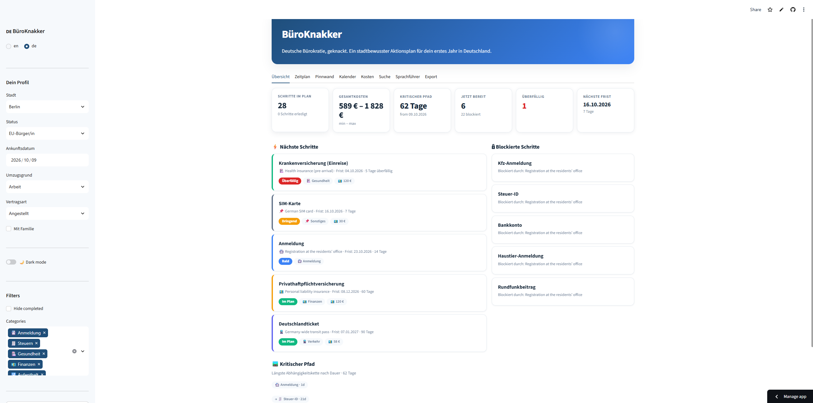

# BüroKnakker

**Germany bureaucracy, cracked.**

A city-aware checklist for expats, students, and international employees — with deadlines, documents, official links, and PDF/ICS export.

[](https://github.com/Gilles177/bueroknakker/actions/workflows/test.yml)
[](https://www.python.org/)
[](https://streamlit.io/)
🔗 **Live demo:** https://bueroknakker-gilles177.streamlit.app/

---

## Problem

Newcomers to Germany miss deadlines and bring the wrong documents to the
Bürgeramt, Ausländerbehörde, and health insurers. The information exists — but
it's scattered across federal, state, and city websites, mostly in German, with
no single source that says: *given who you are and where you landed, do these
things in this order, by these dates, with these papers.*

Concrete failure modes this project targets:

- Missing the 14-day Anmeldung window because nobody told you
- Booking the Ausländerbehörde too late and losing weeks
- Bringing the wrong documents to a Bürgeramt appointment and being sent home
- Following a Berlin guide while living in Hamburg

## Solution

**BüroKnakker** takes a small profile — city, legal status, arrival date,
family — and returns a personalized, ordered action plan:

- **Timeline** — what to do and by when, with a live countdown
- **Checklist** — the exact documents per step, tickable in the UI
- **City Info** — the correct Bürgeramt and Ausländerbehörde links for your city
- **Export** — printable PDF checklist + `.ics` calendar with reminders

Bilingual (DE/EN). No accounts, no tracking, no data leaves the machine.

## Demo




## How it works

```text
        data/steps.yaml          data/cities/*.yaml
        (declarative rules)      (per-city offices)
                │                       │
                └────────────┬──────────┘
                             ▼
                    src/engine.py
              resolve_steps()  +  resolve_link()
                             │
                             ▼
             ┌───────────────┼────────────────┐
             ▼               ▼                ▼
        app.py (UI)   export.py (PDF)   export.py (ICS)
```

The rule engine is intentionally small and pure: given a `UserProfile` and a
list of `Step` objects, it returns the steps that apply, in deadline order,
with resolved links. No Streamlit imports, no I/O, fully unit-tested.

### Why declarative data instead of hardcoded logic

Every bureaucratic step lives in `data/steps.yaml` as structured data, not as
`if` statements. Adding a new city, status, or step is a data change, not a code
change. The `Step` Pydantic model validates every entry at load time, so bad
data fails loudly at startup rather than silently at render.

### The planner

The engine builds a full `ActionPlan` for a profile:

- **Dependency resolution** — `depends_on` forms a DAG. Topological sort yields a safe execution order.
- **Levels** — parallel workstreams for steps with no shared dependencies.
- **Critical path** — longest chain by duration; printed in the PDF as a day-by-day schedule.
- **Cost** — per-step min/max summed to a realistic budget range.
- **Ready vs blocked** — every step classified into what you can do now and what waits on others.

All of this is pure computation on `data/steps.yaml`. No database, no external service. Unit-tested and property-tested with Hypothesis.

### Views

| View | What it answers |
|---|---|
| Dashboard | What needs attention now? KPIs, next actions, blockers, critical path. |
| Timeline | Plotly Gantt of every deadline, coloured by category. |
| Board | Ready / Blocked / Completed — tick items off. |
| Calendar | Month-by-month deadline density. |
| Cost | Per-step bars, category pie, cumulative curve. |
| Search | Full-text across titles, notes, documents, tips. |
| Phrasebook | Every German phrase, grouped by appointment. |
| Export | Book-quality PDF, `.ics` calendar, JSON snapshot. |

### Persistence

Completed steps live in the **URL query string** (`?done=anmeldung,tax_id`). Progress survives refresh, is bookmarkable, and shareable as a link. No accounts, no cookies, no server state.

### Why city-aware links matter

The Anmeldung is federal law, but the office you book it at is municipal.
`Step.link_by_city` overrides the generic `link` per city, so a user in Hamburg
gets `hamburg.de/buergeraemter` while a user in Munich gets
`stadt.muenchen.de`. This is what makes the tool usable beyond a single city.

## Stack

- **Python 3.11+**
- **Streamlit** — UI and hosting
- **Pydantic v2** — typed, validated rule data
- **YAML** — curated, versioned, review-friendly content
- **fpdf2** — PDF export with bundled DejaVu fonts (full Unicode)
- **pytest** — engine, city-consistency, and schema tests

## Architecture

```text
bueroknakker/
├── app.py                    # Streamlit UI — tabs, sidebar, export buttons
├── conftest.py               # puts project root on sys.path for pytest
├── data/
│   ├── steps.yaml            # every bureaucratic step, declarative
│   └── cities/               # per-city Büroamt / Ausländerbehörde URLs
│       ├── berlin.yaml
│       ├── munich.yaml
│       ├── hamburg.yaml
│       └── cologne.yaml
├── src/
│   ├── models.py             # Pydantic: Step, AppliesTo, UserProfile, ...
│   ├── engine.py             # resolve_steps(), resolve_link(), step_applies()
│   ├── i18n.py               # DE/EN strings
│   ├── export.py             # steps_to_pdf(), steps_to_ics()
│   └── fonts/                # DejaVuSans.ttf, DejaVuSans-Bold.ttf
└── tests/
    ├── test_engine.py        # rule engine + link resolution
    └── test_cities.py        # every dropdown city has a YAML
```

## Data sources

Content is curated from official sources only:

- Federal: [bzst.de](https://www.bzst.de) (tax ID), [rundfunkbeitrag.de](https://www.rundfunkbeitrag.de), [elster.de](https://www.elster.de)
- Immigration: [make-it-in-germany.com](https://www.make-it-in-germany.com)
- Municipal: `service.berlin.de`, `stadt.muenchen.de`, `hamburg.de`, `stadt-koeln.de`
- Health: [tk.de](https://www.tk.de)

Every step in `data/steps.yaml` carries a source link.

## DSGVO / privacy

- No accounts, no login, no cookies beyond what Streamlit itself needs
- The profile lives in memory for the session only
- Nothing is sent to a third party
- The whole app can be run offline

## Run locally

```bash
git clone https://github.com/Gilles177/bueroknakker.git
cd bueroknakker

python3 -m venv .venv
source .venv/bin/activate
pip install -r requirements.txt

streamlit run app.py
```

Open <http://localhost:8501>.

> **WSL note:** the app runs fine inside WSL, and the Local URL is reachable
> from the Windows browser automatically.

## Test

```bash
pytest -q
```

Tests cover:

- rule-engine applicability (status, city, family, combinations)
- deadline math and step ordering
- city-specific link resolution with fallback
- every dropdown city has a matching YAML
- `steps.yaml` parses cleanly into the Pydantic models

## Roadmap

- [x] City-aware links (`link_by_city` + `resolve_link`)
- [x] Full Unicode PDF export (bundled DejaVu)
- [ ] Deploy to Streamlit Community Cloud
- [ ] More cities: Frankfurt, Stuttgart, Düsseldorf
- [ ] More statuses: refugee, posted worker, Blue-Card spouse
- [ ] Anmeldung appointment-slot watcher (read-only, opt-in)
- [ ] Optional offline mode (no outbound requests at all)

## Why this project

- **Real problem, real users, real German context** — not another toy dashboard
- **Data-driven rule engine** — declarative YAML, typed with Pydantic, not `if` spaghetti
- **Tested, typed, documented** — pytest, Pydantic v2, README with architecture
- **Deployable** — runs on Streamlit Community Cloud with zero infra
- **Respects the user** — bilingual, offline-capable, DSGVO-friendly by design

## License

MIT — see [LICENSE](LICENSE).
